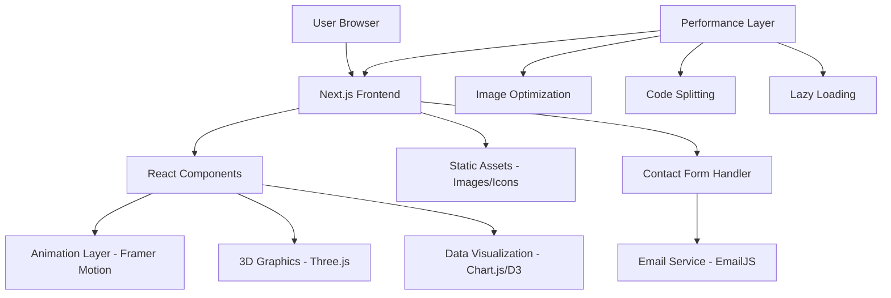

# Interactive Portfolio Design Document

## Overview

This design document outlines the architecture and implementation approach for Monil Bariya's interactive portfolio website. The portfolio will be built as a modern, single-page application (SPA) using React.js with TypeScript, featuring unique interactive elements, smooth animations, and responsive design. The site will showcase technical expertise through live demonstrations, interactive visualizations, and engaging user experiences that reflect modern web development best practices.

## Architecture

### Technology Stack

**Frontend Framework:**

- React 18 with TypeScript for type safety and modern development practices
- Next.js 14 for server-side rendering, optimization, and deployment capabilities
- Tailwind CSS for utility-first styling and responsive design

**Animation & Interactions:**

- Framer Motion for smooth animations and page transitions
- Three.js with React Three Fiber for 3D elements and particle effects
- Lottie React for micro-animations and interactive icons

**Data Visualization:**

- Chart.js with React-Chartjs-2 for interactive skill charts and project metrics
- D3.js for custom data visualizations and skill tree implementation

**Performance & Optimization:**

- Next.js Image component for optimized image loading
- React.lazy() for code splitting and lazy loading
- Intersection Observer API for scroll-triggered animations

**Deployment & Hosting:**

- Vercel for seamless Next.js deployment and global CDN
- GitHub for version control and continuous deployment

### System Architecture



## Components and Interfaces

### Core Components Structure

**Layout Components:**

- `Header`: Navigation with smooth scroll links and mobile hamburger menu
- `Footer`: Contact information and social media links
- `Layout`: Main wrapper component with consistent styling and meta tags

**Section Components:**

- `HeroSection`: Dynamic introduction with animated text and particle background
- `AboutSection`: Personal introduction with interactive hobby showcase
- `SkillsSection`: Interactive skill tree and proficiency visualizations
- `ProjectsSection`: Filterable project grid with detailed modal views
- `ExperienceSection`: Timeline of certifications and professional simulations
- `ContactSection`: Contact form with validation and social media integration

**Interactive Components:**

- `SkillTree`: Custom D3.js visualization showing skill relationships and proficiency
- `ProjectCard`: Hover-interactive cards with technology tags and preview images
- `ProjectModal`: Detailed project view with screenshots, code snippets, and live demos
- `ParticleBackground`: Three.js particle system for dynamic visual effects
- `AnimatedCounter`: Number counting animations for statistics and achievements
- `ContactForm`: Validated form with real-time feedback and submission handling

### Component Interfaces

```typescript
interface ProjectData {
  id: string;
  title: string;
  description: string;
  technologies: string[];
  images: string[];
  liveDemo?: string;
  githubRepo?: string;
  challenges: string[];
  features: string[];
  impact: string;
}

interface SkillData {
  category: string;
  skills: {
    name: string;
    proficiency: number; // 0-100
    projects: string[]; // Project IDs
    certifications: string[];
  }[];
}

interface CertificationData {
  id: string;
  title: string;
  issuer: string;
  date: string;
  description: string;
  skills: string[];
  achievements: string[];
}
```

## Data Models

### Portfolio Data Structure

The portfolio will use a centralized data structure stored in TypeScript files for type safety and easy maintenance:

```typescript
// types/portfolio.ts
export interface PortfolioData {
  personal: PersonalInfo;
  skills: SkillCategory[];
  projects: Project[];
  experience: Experience[];
  education: Education[];
  certifications: Certification[];
  hobbies: Hobby[];
}

export interface PersonalInfo {
  name: string;
  title: string;
  location: string;
  email: string;
  phone: string;
  linkedin: string;
  summary: string;
  availability: 'Available' | 'Busy' | 'Not Available';
}

export interface Project {
  id: string;
  title: string;
  description: string;
  longDescription: string;
  technologies: Technology[];
  category: 'Web Development' | 'AI/ML' | 'Data Visualization' | 'Mobile';
  images: string[];
  demoUrl?: string;
  githubUrl?: string;
  featured: boolean;
  completionDate: string;
  teamSize: number;
  challenges: Challenge[];
  features: Feature[];
  metrics?: ProjectMetrics;
}
```

### Content Management

- Static data stored in JSON/TypeScript files for easy updates
- Image assets organized in public/images with optimized formats (WebP, AVIF)
- Content versioning through Git for change tracking
- Environment-based configuration for development and production

## Error Handling

### Client-Side Error Handling

**Component Error Boundaries:**

- React Error Boundary components to catch and handle component crashes
- Fallback UI components for graceful degradation
- Error logging to console in development, silent handling in production

**Animation Fallbacks:**

- CSS-based fallbacks for JavaScript animation failures
- Reduced motion support for accessibility preferences
- Progressive enhancement approach for 3D elements

**Network Error Handling:**

- Retry mechanisms for failed API calls (contact form submission)
- Offline detection and appropriate user messaging
- Graceful degradation for missing images or assets

### Performance Error Handling

**Loading States:**

- Skeleton screens for content loading
- Progressive image loading with blur-up technique
- Lazy loading with intersection observer fallbacks

**Memory Management:**

- Cleanup of Three.js scenes and animations on component unmount
- Event listener cleanup in useEffect hooks
- Debounced scroll and resize event handlers

## Testing Strategy

### Unit Testing

- Jest and React Testing Library for component testing
- Test coverage for all interactive components and utility functions
- Snapshot testing for consistent UI rendering
- Mock implementations for Three.js and animation libraries

### Integration Testing

- End-to-end testing with Playwright for critical user journeys
- Cross-browser testing on Chrome, Firefox, Safari, and Edge
- Mobile device testing on iOS and Android simulators
- Performance testing with Lighthouse CI

### Accessibility Testing

- Automated accessibility testing with axe-core
- Keyboard navigation testing for all interactive elements
- Screen reader compatibility testing
- Color contrast validation for WCAG compliance

### Performance Testing

- Core Web Vitals monitoring and optimization
- Bundle size analysis and optimization
- Image optimization and lazy loading validation
- CDN performance testing across geographic regions

## Implementation Approach

### Phase 1: Foundation Setup

- Next.js project initialization with TypeScript configuration
- Tailwind CSS setup with custom design system
- Component structure and routing implementation
- Basic responsive layout without animations

### Phase 2: Content Integration

- Static data integration with TypeScript interfaces
- Basic component implementation for all sections
- Image optimization and asset management
- Mobile-responsive design implementation

### Phase 3: Interactive Features

- Framer Motion animation integration
- Three.js particle system implementation
- Interactive skill tree and data visualizations
- Project filtering and modal functionality

### Phase 4: Advanced Features

- Contact form with validation and email integration
- Performance optimization and lazy loading
- SEO optimization and meta tag implementation
- Cross-browser testing and bug fixes

### Phase 5: Polish & Deployment

- Final animations and micro-interactions
- Accessibility improvements and testing
- Performance optimization and Lighthouse scoring
- Vercel deployment and domain configuration

## Unique Design Elements

### Interactive Skill Tree

- Custom D3.js visualization showing skill relationships
- Hover effects revealing related projects and certifications
- Animated skill level indicators with smooth transitions
- Filterable by skill category or proficiency level

### Project Showcase Innovation

- 3D card hover effects with CSS transforms
- Live demo integration with iframe previews
- Interactive code snippet highlighting
- Technology tag filtering with smooth animations

### Particle Background System

- Three.js particle system responding to mouse movement
- Color-coded particles representing different skill categories
- Performance-optimized with requestAnimationFrame
- Mobile-friendly with reduced particle count

### Data Visualization Integration

- Live charts showing project impact and metrics
- Interactive timeline for certifications and achievements
- Skill proficiency radar chart with smooth animations
- GitHub contribution-style activity calendar

This design creates a truly unique portfolio that demonstrates technical expertise while providing an engaging, memorable user experience that will set Monil apart from other candidates in the competitive tech industry.
